## Instituição
ETEC Vasco Antônio Venchiarutti
## Curso
Desenvolvimento de Sistemas

## Turma
2ºC1
## Autores
Alison Gustavo Valli  
Julia Furtado Polycarpo

---

# Projeto 1 – Primeiro Aplicativo (pg. 27)

### Descrição

O objetivo do aplicativo é simples; quando o botão “Clique aqui” é apertado, a mensagem “Olá mundo!!” aparece na tela e um som é reproduzido ao mesmo tempo. Além disso, o aplicativo possui o botão “Limpar”, que apaga a mensagem exibida, e o botão “Fechar”, que encerra o aplicativo. A principal diferença em relação ao exemplo da apostila é que foi adicionado um efeito sonoro ao clicar no botão “Clique aqui”, deixando o aplicativo um pouco mais interativo.

### Print das telas do Design
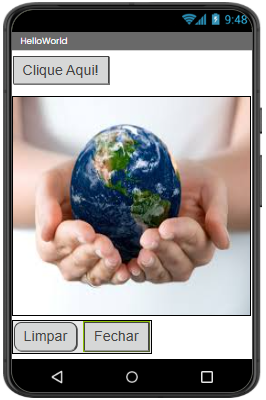

### Print das telas dos Blocos
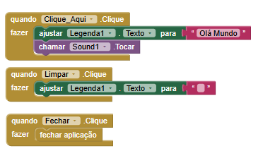

---

# Projeto 2 – Segundo Aplicativo (pg. 46)

### Descrição
O objetivo do aplicativo é que o usuário possa desenhar na tela do celular; quando o usuário arrasta o dedo pela tela, linhas são desenhadas como se fosse um pincel. O aplicativo possui botões com as cores vermelho, verde, azul, amarelo e preto, que servem para mudar a cor do desenho. Também existe o botão “Limpar”, que apaga todos os riscos da tela, e além disso, ao balançar o celular, o desenho também é apagado. Em relação ao exemplo da apostila, foi adicionada a cor preta e a função de apagar o desenho ao balançar o celular, além do botão de limpar.

### Print das telas do Design
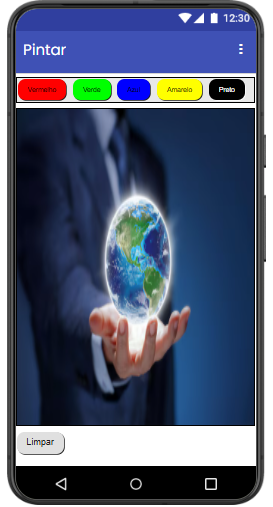  
### Print das telas dos Blocos
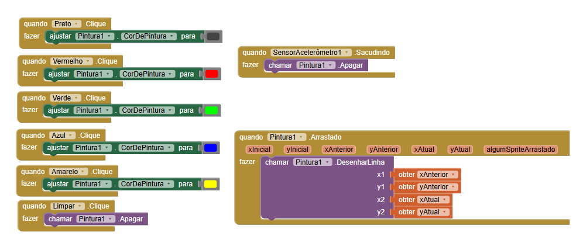
---

# Projeto 3 – Terceiro Aplicativo (pg. 56)

### Descrição
O objetivo do aplicativo é simular o funcionamento de um liquidificador; quando o botão do liquidificador é apertado, o aplicativo reproduz um som e faz o celular vibrar, imitando um liquidificador ligado. Se o botão for apertado novamente enquanto o liquidificador já estiver ligado, o som e a vibração param imediatamente. Em relação ao exemplo da apostila, foi adicionada a função de desligar o liquidificador ao clicar no botão novamente.

### Print das telas do Design
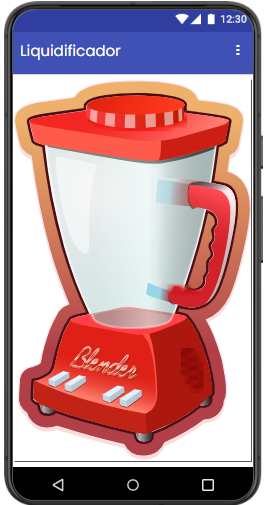  
### Print das telas dos Blocos
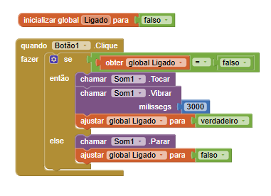

---

# Projeto 4 – Quarto Aplicativo (pg. 64)

### Descrição
Descrever objetivo, funcionamento e modificações realizadas.

### Print das telas do Design
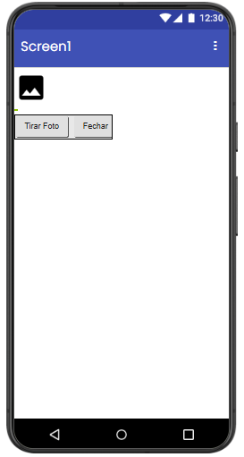  
### Print das telas dos Blocos
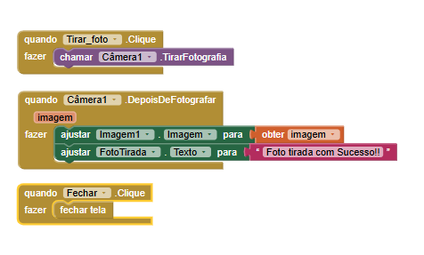

---

# Projeto 5 – Quinto Aplicativo (pg. 69)

### Descrição
Descrever objetivo, funcionamento e modificações realizadas.

### Print das telas do Design
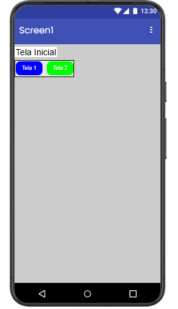
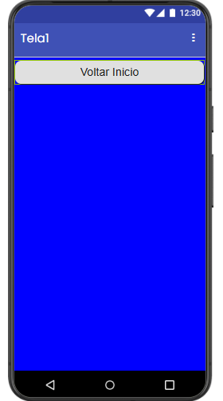
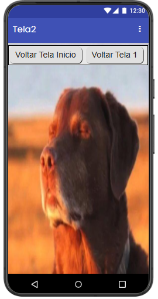  
### Print das telas dos Blocos
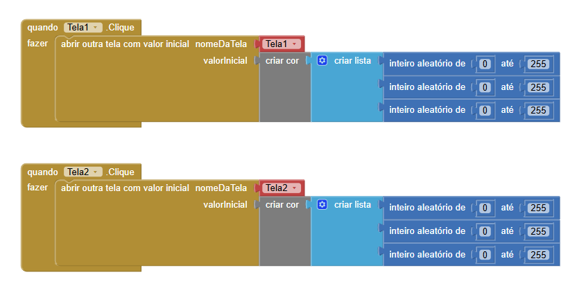
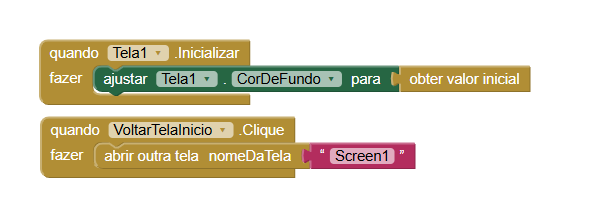
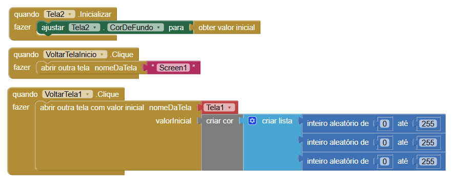

---

# Projeto 6 – Sexto Aplicativo (pg. 82)

### Descrição
Descrever objetivo, funcionamento e modificações realizadas.

### Print das telas do Design
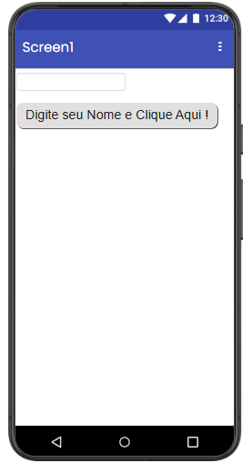  
### Print das telas dos Blocos
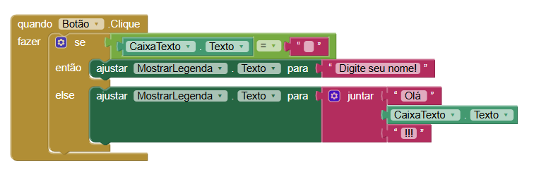

---
