## Instituição
Centro Paula Souza  
Etec Vasco Antonio Venchiarutti – Jundiaí - SP  
## Curso
Desenvolvimento de Sistemas  
## Turma
2ºC1  
## Autores
Alison Gustavo Valli  
Julia Furtado Polycarpo  
---

# 📱 Projeto

## Título
(nome do aplicativo criado pelo grupo)

---

## Descrição

O objetivo do aplicativo é apresentar um quiz interativo que busca conscientizar o usuário sobre a importância de aspectos culturais, históricos e sociais de países do Oriente Médio, usando imagens como forma principal de aprendizado. A proposta é mostrae que esses lugares vão além dos conflitos, destacando elementos da cultura e da identidade dos povos.  
Funciona por níveis, em cada um, aparece uma imagem com uma pergunta e três opções. O usuário escolhe uma, o sistema verifica se está certa, mostrando uma mensagem dizendo se acertou ou não, acompanhado de um som correspondente e atualiza a pontuação. O acerto adiciona um e o erro subtrai um. E no final aparece a soma total.  
Como na apostila, foram utilizados componentes visuais para o design(botões, imagens, sons, notifier e relógio), uso de variáveis para os níveis e pontos, importantes para verificação de respostas e cliques interativos. Comparando com os da apostila, é mais complexo já que junta diversos conceitos.  

---

## 🖥 Print das telas do Design

  <b>Menu</b> 
  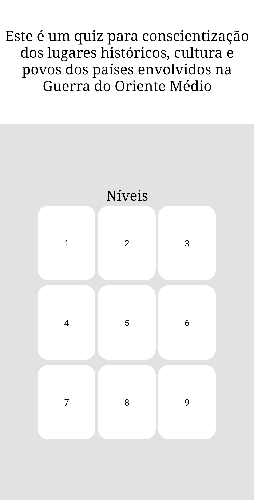

  <b>Níveis</b> 
  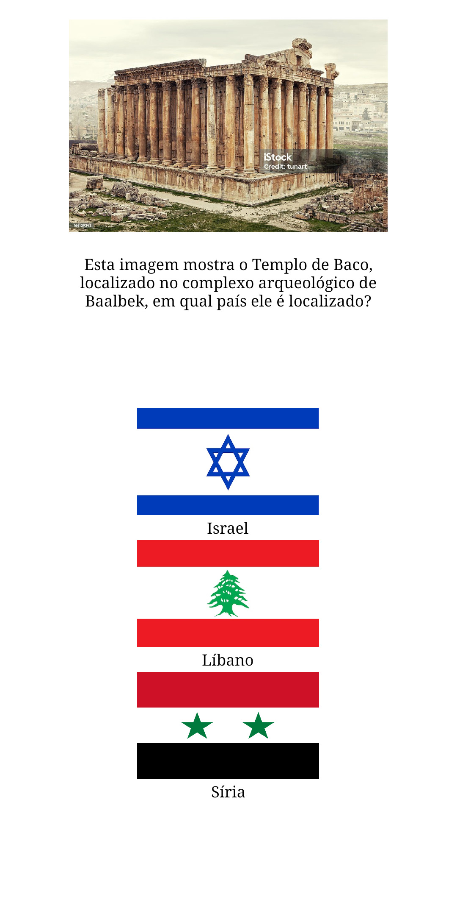
  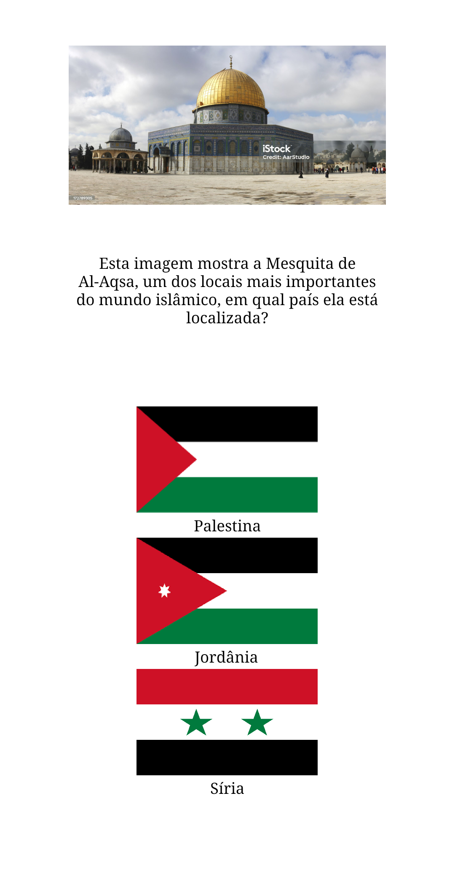
    

  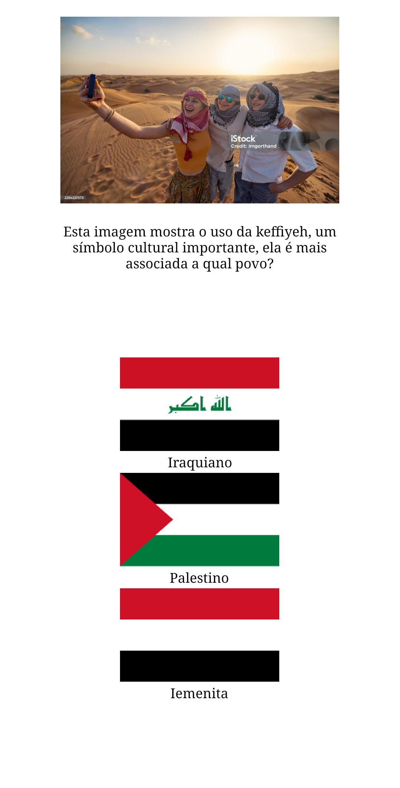
  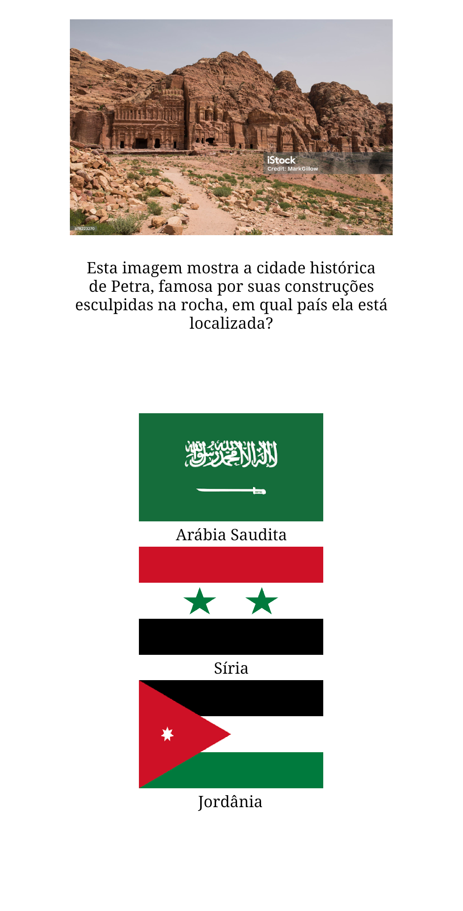
  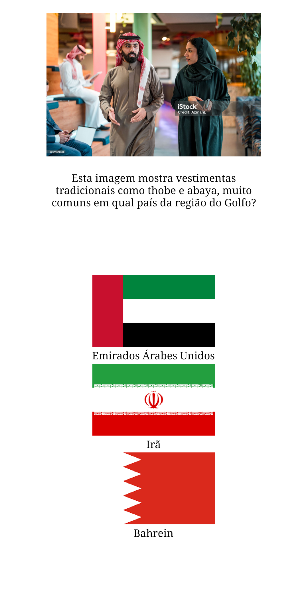  

  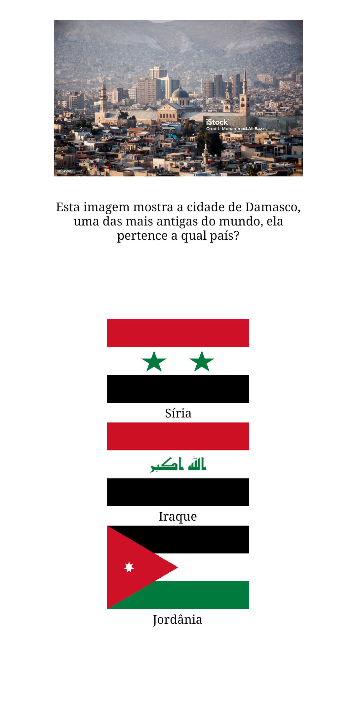
  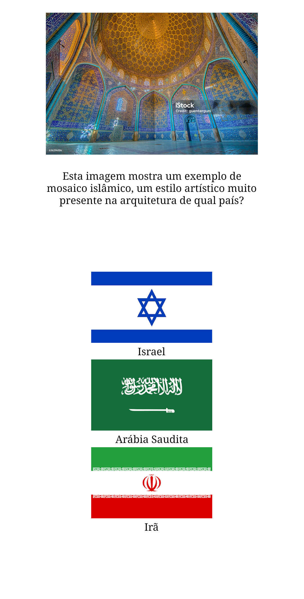
  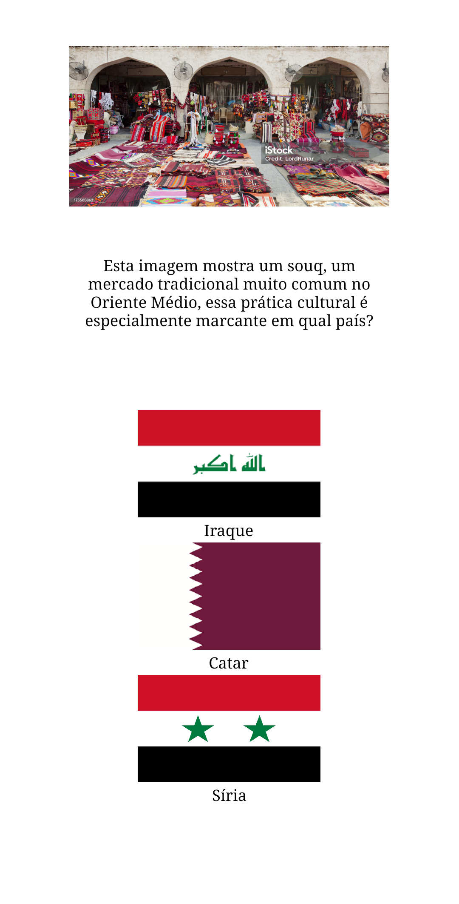

  <b>Notificações</b> 
  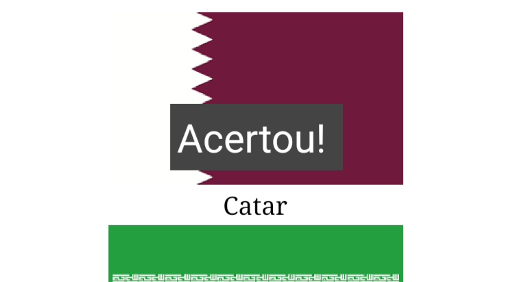
  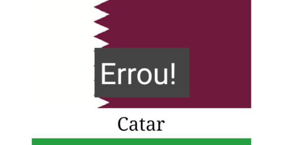

---

## 🧩 Print das telas dos Blocos

  <b>Screen1 (Menu)</b> 
  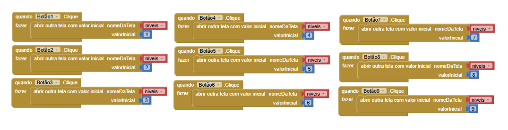

  <b>Botões</b> 
  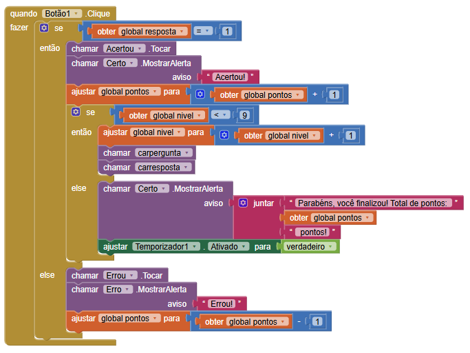
  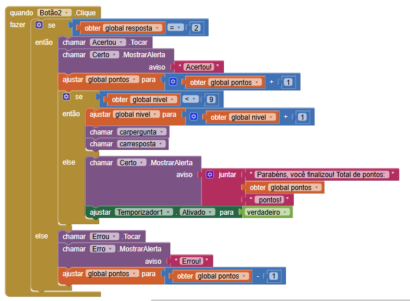
  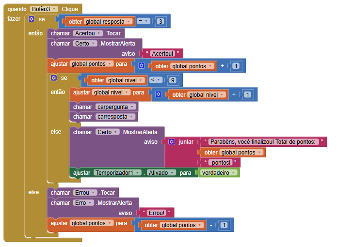

  <b>Início, Variáveis e Final</b> 
  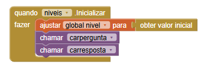
  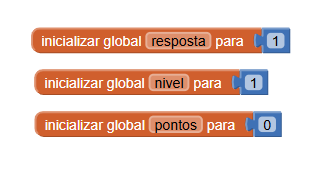
  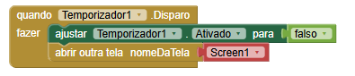

  <b>Perguntas</b> 
  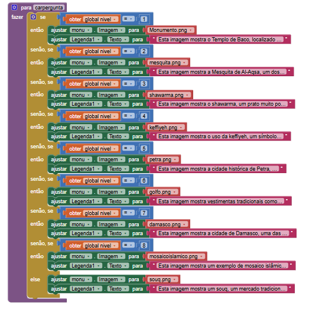

  <b>Opções</b> 
  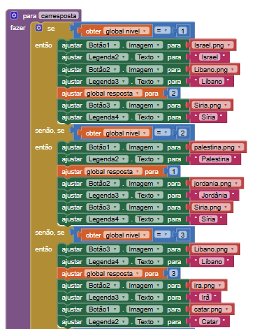
  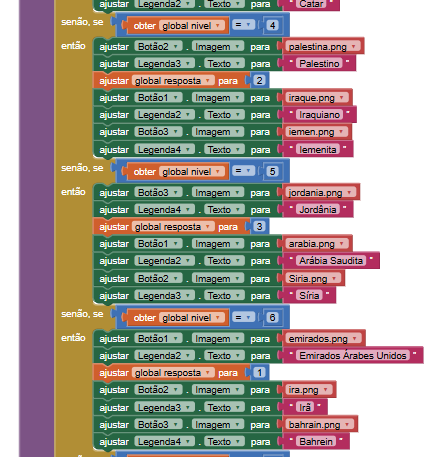
  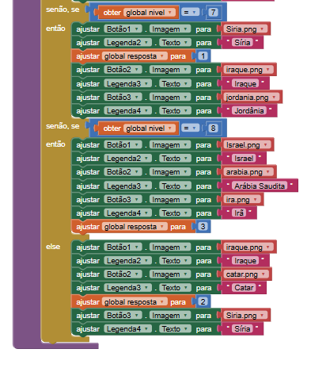

---
